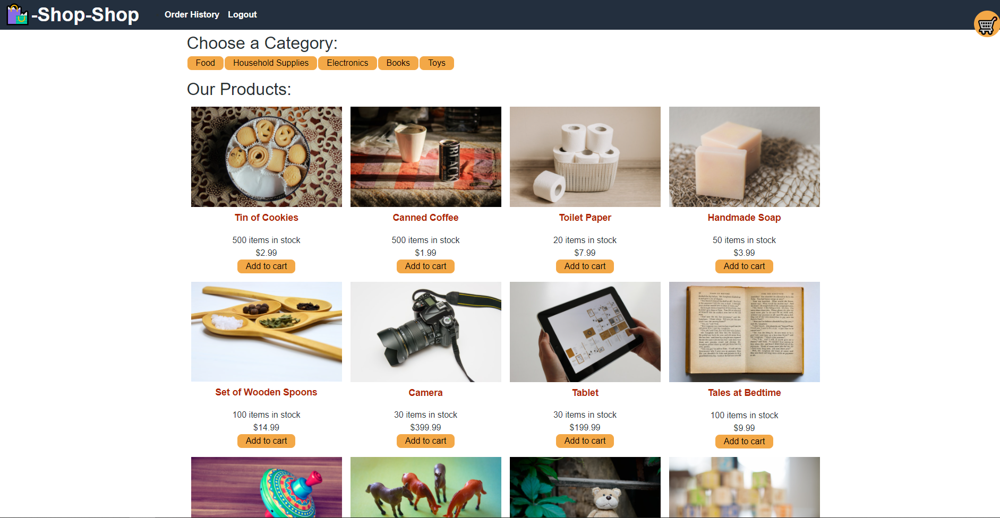

# shop-shop


## Description:<br>
This is a fully functiong Full Stack e-commerce web application. Browse the different categories, add to your cart and even sign in/sign up to checkout! (although it is only a test checkout for learning purposes) <br><br>


## Technologies used:

* Javascript
* Node.js
* HTML
* CSS
* Mongoose/MongoDB
* React
* Apollo
* Graphql
* Redux

<br><br>

## Usage:

In the root directory in your command line run the command
```
npm i
```
To install all necessary dependencies. then run
```
npm run seed
```
 To seed the data base with the proper items. Finally, to start your local server for local testing run the command
 ```
 npm start
 ```
 and You can find the local page at http://localhost:3000/ in your browser!
 <br><br>
Alternatively, you can checkout the deployed site at the link below!

https://enigmatic-island-98076.herokuapp.com/
<br><br>

## Preview:



## License:

This project is licensed under the MIT license.
<br><br>

## Questions:

If you have any questions about the repo, open an issue or contact me directly at Jespi116@fiu.edu. you can find more of my work at [Jespi116](https://github.com/Jespi116)
